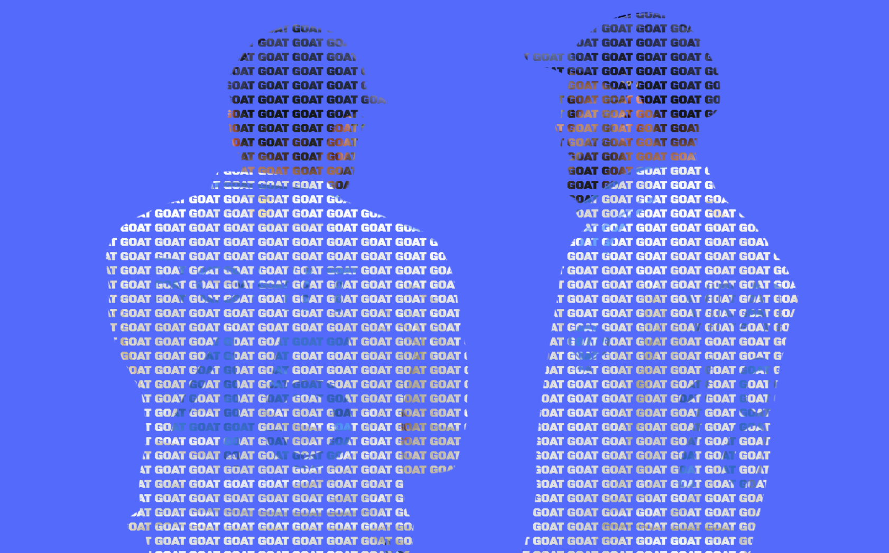

# Background Text Effect  

This project creates a **cool text effect** where the word "GOAT" appears with a **background image clip** using CSS properties like `-webkit-background-clip` and `-webkit-text-fill-color`. The background image can be updated as per preference.  

## Features  
- **Stylish text effect** with an image background  
- Uses **Google Fonts** for a bold look  
- **Full-screen responsive design**  
- Simple **HTML and CSS** implementation  

## Preview  
  

## Technologies Used  
- HTML5  
- CSS3  
